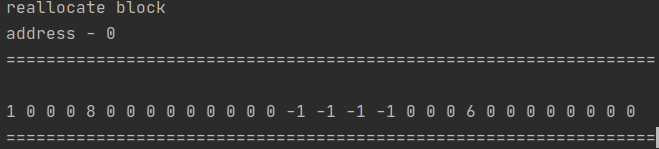

# Memory Allocator imitation on Java
## Explanation
* int ALIGNMENT_SIZE
##### min size of block and all blocks are aliquot of it
* Integer mem_alloc(int size)
##### function, which allocate memory by some size
* Integer mem_realloc(int address, int newSizeOfExistingBlock)
##### function that reallocate an existed block of memory to new or extend current
* void mem_free(int address)
##### function that takes address of an existed block and mark him as free
* void mem_dump()
##### function which show state of our memory
## Work examples
* Integer mem_alloc(int size)
#### before

#### after

* Integer mem_realloc(int address, int newSizeOfExistingBlock)
#### before

#### after

* void mem_free(int address)
#### before

#### after

