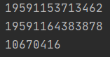

# Memory optimization in Java
### Measure with original code(partly rewritten to Java)

### Measure original code with difference and with bigger bounds(10 vs 100)

### Measure after replacing column order

### Measure after changing int type to byte

### Measure after replacing increment order(asc to desc)

## As you can see execution time was reduced by 3 times - from 32109764 to 10670416.
## This result for memory optimization show that it make sense
