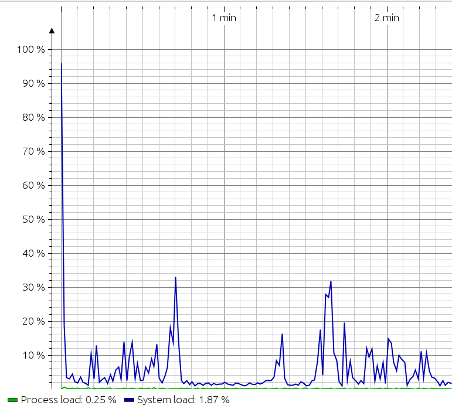
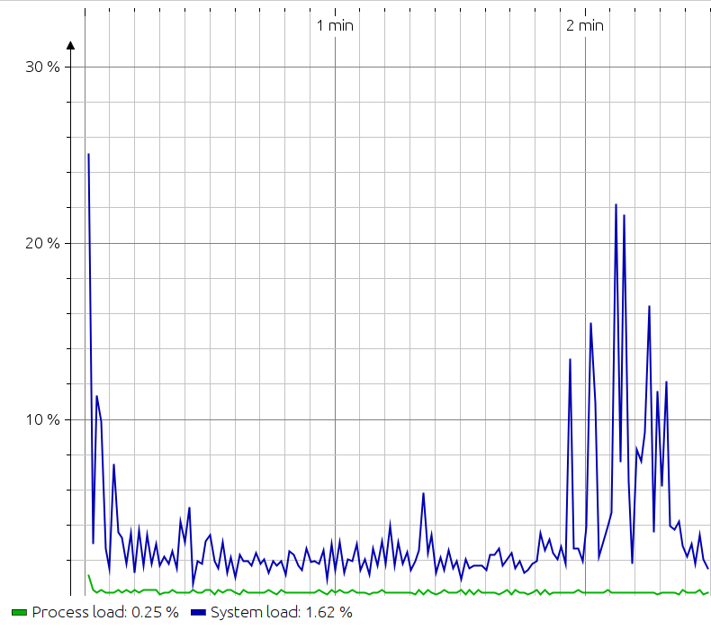

# Profiling program with JProfiler
### Original code(partly rewritten to java)
    public static final Scanner SCANNER = new Scanner(System.in);

    public static boolean func1(int a) throws InterruptedException {
        for (int i = 0; i < 100_000_000; i++) {
            sleep(1);
            if (i > a) {
                return false;
            }
        }

        return false;
    }

    public static boolean func2() throws InterruptedException {
        for (int i = 0; i < 10; i++) {
            sleep(10_000_000);
        }
        return false;
    }

    public static boolean func3(int b) throws InterruptedException {
        for (int i = 10; i > 3; i++) {
            sleep(1);
            if (i < b) {
                return false;
            }
        }
        return false;
    }

    public static void main(String[] args) throws InterruptedException {
        System.out.println("\n Inside main()");
        String typeOfShape;
        typeOfShape = SCANNER.next();

        int i = 0;

        for (; i < 10; i++) {
        }
        {
            for (int j = 1_000_000; j > 0; j--) {
                if (func1(i) || func2() || func3(j)) {
                    System.out.println("\n Inside if()");
                }
            }
        }
    }
## Measurements of Process and System load for original code:

# Enhancements:
* Removed sleep method
* Removed unused throws signature
### Code after enhancements
public static final Scanner SCANNER = new Scanner(System.in);

    public static boolean func1(int a) {
        for (int i = 0; i < 100_000_000; i++) {
            if (i > a) {
                return false;
            }
        }
        return false;
    }

    public static boolean func2() {
        for (int i = 0; i < 10; i++) {
        }
        return false;
    }

    public static boolean func3(int b) {
        for (int i = 10; i > 3; i++) {
            if (i < b) {
                return false;
            }
        }
        return false;
    }

    public static void main(String[] args) {
        System.out.println("\n Inside main()");
        String typeOfShape;
        typeOfShape = SCANNER.next();

        int i = 0;

        for (; i < 10; i++) {
        }
        {
            for (int j = 1_000_000; j > 0; j--) {
                if (func1(i) || func2() || func3(j)) {
                    System.out.println("\n Inside if()");
                }
            }
        }
    }
## Measurements of Process and System load for edited code:

## As we can see - process and system load decreased after our changes, which was maiden after profiling. What show that is usable tool 

